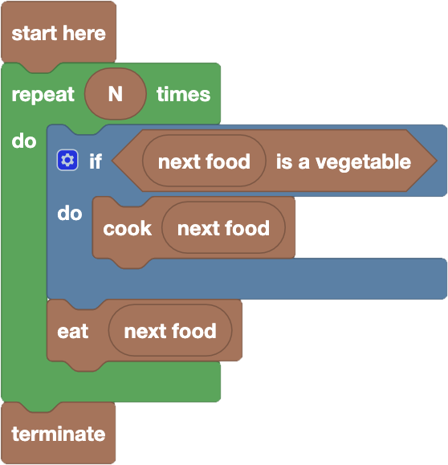

import initialBlocks from "./initial-blocks.json";
import customBlocks from "./s1.blocks.yaml";
import testcases from "./testcases.py";
import Visualizer from "./visualizer.jsx";

Tip-Tap has to prepare lunch and has lined up $N$ foods he wants to eat.
Each food is a vegetable or a fruit, and Tip-Tap only wants to eat **raw fruit** and **cooked vegetables**.
You have these blocks available:

  - `N`: the number of foods that Tip-Tap has lined up.
  - `next food`: the next food that Tip-Tap hasn't eaten yet.
  - $x$ `is a vegetable`: true if food $x$ is a vegetable.
  - `cook` $x$: cook food $x$.
  - `eat` $x$: eat food $x$.
  - `terminate`: stop eating.

Write a program that allows Tip-Tap to have lunch in the way he likes!

<Blockly
  customBlocks={customBlocks}
  initialBlocks={initialBlocks}
  testcases={testcases}
  visualizer={Visualizer}
/>

> A possible correct program is the following:
>
> 
>
> According to this program, for each of the $N$ foods Tip-Tap wants to eat, the protagonist checks if
> the next food is a vegetable, and if so, cooks it before eating it. At this point he eats the next food
> (whether it's a vegetable or a fruit), which will be to his liking: cooked vegetable or raw fruit.