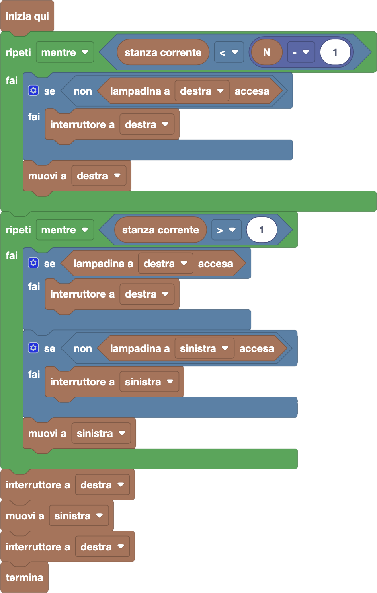

import initialBlocks from "./initial-blocks.json";
import customBlocks from "./s3.blocks.yaml";
import testcases from "./testcases.py";
import Visualizer from "./visualizer.jsx";

Bunny oggi è rimasto a studiare fino a tarda notte nella sua stanza, mentre i suoi amici hanno già iniziato a fare cena insieme intorno al fuoco in giardino.
Ora Bunny li vuole raggiungere, però c'è un problema: ha paura del buio, quindi non è disposto ad entrare in una stanza se prima non ne accende la luce.
D'altra parte, Bunny è anche molto attento all'ambiente e non vuole lasciare luci accese prima di uscire fuori... neanche quelle che i suoi amici hanno
dimenticato accese!

La Fattoria Fibonacci è fatta da $N$ stanze disposte in fila, come un lungo corridoio, separate da porte e numerate $1$, $2$, $\ldots$, $N$.
L'esterno della fattoria viene rappresentato come la stanza numero zero.
In ogni stanza ci sono due interruttori, che servono per accendere le lampadine delle stanze a destra e a sinistra.
Il lampadario della prima stanza si può anche spegnere dall'esterno.
Quando un interruttore viene premuto, accende la lampadina se è spenta e la spegne se è accesa.
Hai a disposizione questi blocchi:

- `N`: il numero di stanze.
- `stanza corrente`: il numero della stanza corrente, $0$ (esterno) oppure da $1$ a $N$ (stanze).
- `muovi a destra/sinistra`: spostati nella stanza a destra/sinistra della stanza corrente.
- `interruttore a destra/sinistra`: premi l'interruttore che comanda la stanza a destra/sinistra.
- `lampadina a destra/sinistra accesa`: vero se la lampadina nella stanza a destra/sinistra è accesa.
- `termina`: raggiungi i tuoi amici per la cena intorno al fuoco.

Aiuta Bunny a spegnere le luci e raggiungere gli amici, senza trovarsi mai al buio!

<Blockly
  customBlocks={customBlocks}
  initialBlocks={initialBlocks}
  testcases={testcases}
  visualizer={Visualizer}
/>

> Un possibile programma corretto è il seguente:
>
> 
>
> Come prima cosa, Bunny deve controllare che non siano rimaste luci accese sulla sua destra, e
> percorre quindi tutte le stanze andando a destra fino alla penultima stanza (fermandosi quindi
> quando la stanza corrente è la numero $N-1$). Prima di andare a destra deve però controllare
> se la lampadina fosse spenta, accendendola quindi per evitare la sua paura del buio.
>
> Alla fine di questo primo ciclo, Bunny si troverà nella penultima stanza della fattoria, e può
> cominciare a tornare indietro spendendo le luci dietro di sè. Procede quindi con un altro ciclo
> in cui va a sinistra, fino alla prima stanza. Ad ogni passo controlla se la luce alla sua destra
> (da dove proviene) è accesa, e in caso la spegne. Poi per evitare la paura del buio controlla anche
> se la luce alla sua sinistra (dove vuole andare) è spenta, e in caso la accende.
>
> Alla fine del secondo ciclo, Bunny si troverà nella prima stanza della fattoria, avendo spento tutte
> le altre luci eccetto quella della seconda stanza. Non dovrà quindi fare altro che spegnere la seconda
> stanza, uscire, spegnere la luce nella prima stanza e poi raggiungere i suoi amici!
>
> [primarie](primarie.asy)
> [secondarie](secondarie.asy)
